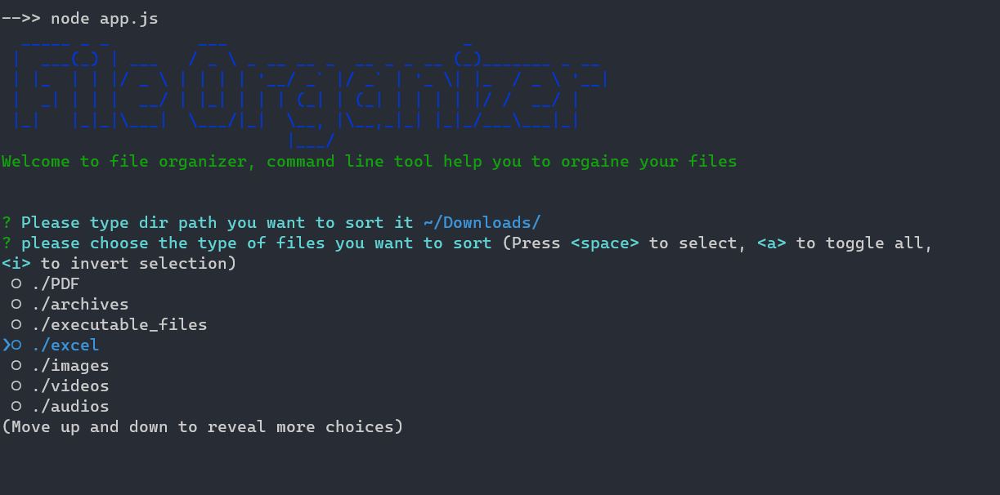

# File Organizer
command line tool help you to organise  your files
## Getting Started

### Prerequisites
-you must install nodejs in your system
-Terminal or gitbash for windows
### Installation

first you must clone the project using git

```bash
git clone https://github.com/moayadalsariya/file_organizer.git
```
Then cd to file_organizer

```bash
cd file_organizer
```
install dependencies using npm install

```bash
npm install
```

run the program

```bash
node app.js
```


## Screenshot


## License
[MIT](https://choosealicense.com/licenses/mit/)
